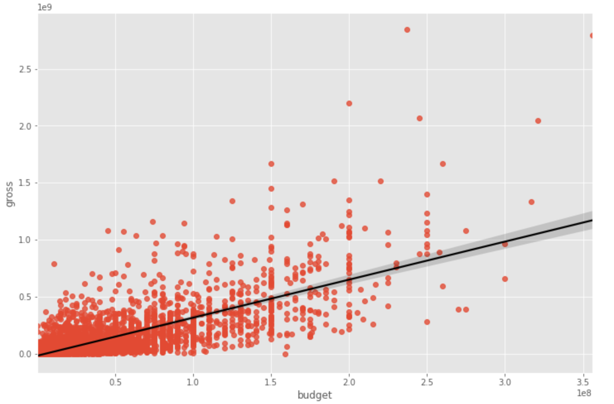
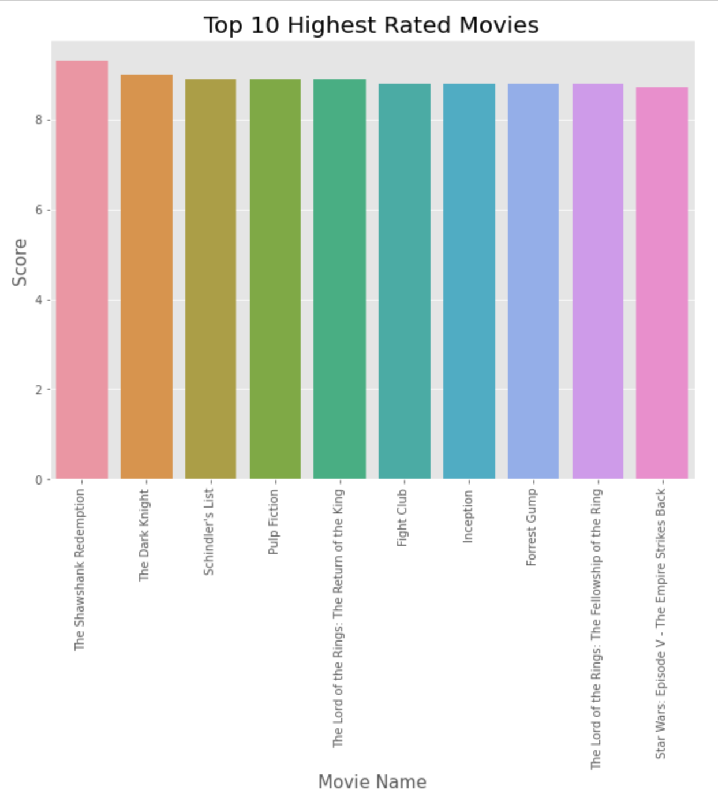
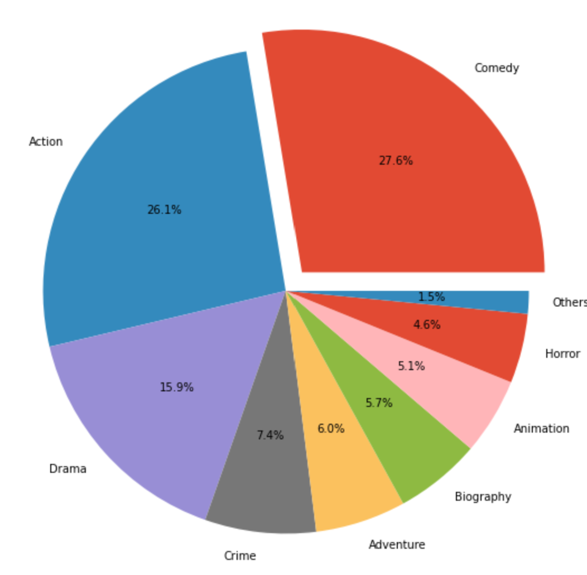

# Data analysis on IMDb movies data
* Ran data analysis and tested my hypothesis on what can affect a movie gross earnings
* Produced some figures that can make understanding the dataset easy

## Programming Language & Packages
* Python
* Packages: numpy, pandas, matplotlib, seanborn, plotly, wordcloud

## Data cleaning
The dataset is well formated, just some missing data in the following features:
* budget: 2171
* gross: 189
* rating: 77
* company: 17
* runtime: 4
* score: 3
* votes: 3
* writer: 3
* country: 3
* released: 2
* star: 1
I chose to delete all rows that had missing values.
Changed votes, budget, gross features from object data type into int data type.
Converted all categorical features into numberical.

## Exploratory Data Analysis (EDA)
Ran some python code to help me answering some questions related to the gross (e.g., gross based on budget, gross based on company, gross based on star)
I also plot a heatmap for all the features to check the correlations between them.

## Visualizing
Using different plots to make the dataset easy to understand and to draw som insights from it. 
Some of these plots are ment to check the correlations, others are ment to find some info related to the earning gross. 

    

## Resources
Movie industry dataset: https://www.kaggle.com/danielgrijalvas/movies  
